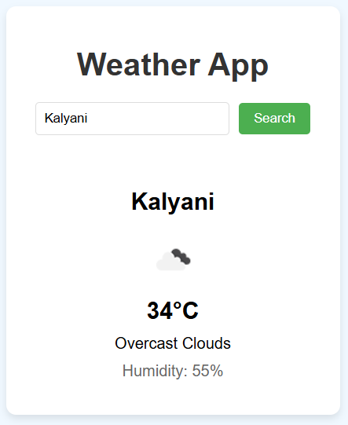

# Weather App 🌦️

A simple, API-based weather application that displays current weather conditions for any city worldwide.



## Features ✨

- 🌡️ Real-time temperature (in °C)
- 💧 Humidity percentage
- ☀️ Weather conditions with icons
- 🔍 City search functionality
- 📱 Responsive design for all devices

## Live Demo

You can view a live version of this tool at [(https://kanaimandal2002.github.io/weather-app/)]

## Getting Started 🚀

### Prerequisites

- Web browser (Chrome, Firefox, Safari, Edge)
- [OpenWeatherMap API key](https://openweathermap.org/api) (free tier available)

### Installation

1. Clone the repository:
   ```bash
   git clone https://github.com/kanaimandal2002/Weather-App.git
   cd Weather-App
